<a id="top"></a>

<div align="center">

# 🔥 FR3 多机械臂柔性钎焊产线

### 从动态订单，到协同加工、故障返工、三层炉批与成品交付

<p>
  
  
  
  
  
  
</p>


> 📌 本页素材已于 **2026-09-01** 按当前 V2 场景重新采集；WebP 动图优先保证清晰度，GIF 仅作兼容下载。

**三台 FR3 · 六套实体托盘 · 双翅片安装支路 · 三层贯通炉 · 可见故障恢复**

[🎬 看动态流程](#live-tour) · [🖼️ 看工位图库](#scene-gallery) ·
[📊 看最新效率](#performance) · [🚀 立即运行](#quick-start) ·
[🧩 看柔性能力](#flexibility) · [📚 找代码和文档](#project-map)

</div>

---

## 👀 30 秒看懂

用户加入 A/B/C/D 或合法自定义订单后，系统会自动生成产品几何、工艺路线、任务 DAG、
托盘流转与炉批计划，再驱动真实 MuJoCo actor 完成生产闭环。

| 🦾 Arm1 | 💧 Arm2 | 📷 Arm3 | 🔥 物流与炉体 |
|:---:|:---:|:---:|:---:|
| 基板上料<br>吸盘/夹爪物理换刀<br>翅片安装 | 双喷嘴蛇形涂覆<br>局部补涂 | 材料/焊前检测<br>空闲时服务 B 线安装 | 六托盘滚动 WIP<br>三层炉批<br>后门卸料与交付 |

### 当前版本一眼数据

| 实体能力 | 最新完整运动实测 | 质量门槛 |
|---|---|---|
| `3` 台 FR3 · `2` 条安装支路 · `6` 套托盘 | 三件 A：`173.35 s`<br>A/B/C 各一件：`169.35 s` | Phase 6–8 关键测试通过* |
| 单炉最多 `3` 件 · `24` 条钎料路径 · `12` 片翅片 | 支持多订单滚动、并行安装与故障闭环 | Viewer/headless 同一物理主线 |

> 这里的“快”以**仿真事件完工时间**计算；README 动图使用加速采样，只负责展示过程，
> 不参与 KPI。

> ⚠️ 速度口径说明：当前 V2 与旧 V1 的场景和工艺链并不等价（V2 包含双安装支路、
> 多托盘滚动、真实检测/互锁/故障闭环等额外物理步骤）。因此 V1 数字只用于旧入口
> 回归检查，不能用来宣称 V2 更快或更慢；正式性能结论需使用相同工序、相同物理
> 完成条件和相同仿真配置的 A/B 基准。

<a id="live-tour"></a>

## 🎬 六段动图看完整流程

<table>
  <tr>
    <td width="50%" align="center"><strong>① Arm1 物理换刀</strong><br>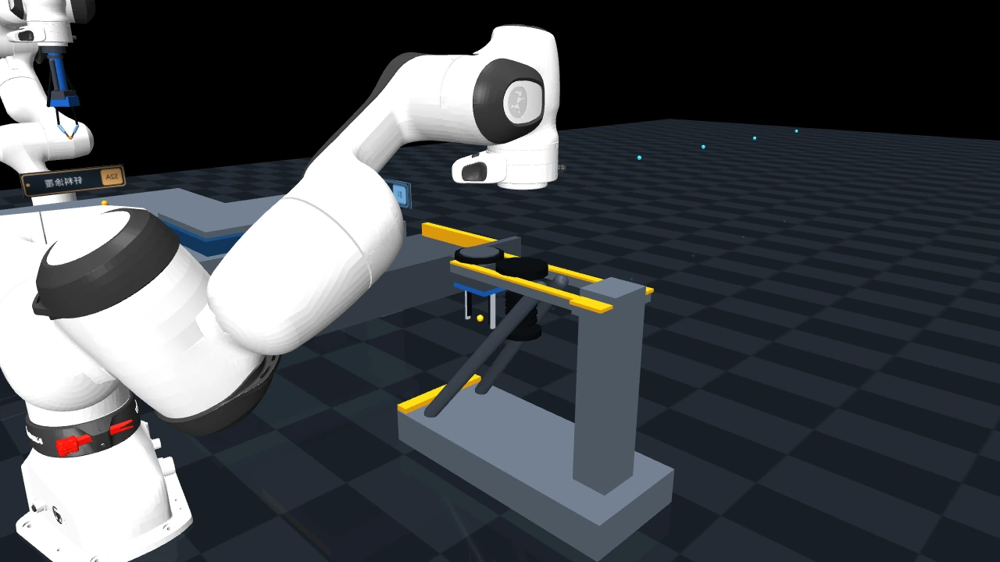<br><sub>高位横移 → 纯 Z 慢降 → 挂接 → 纯 Z 离架</sub></td>
    <td width="50%" align="center"><strong>② 吸取并安装基板</strong><br>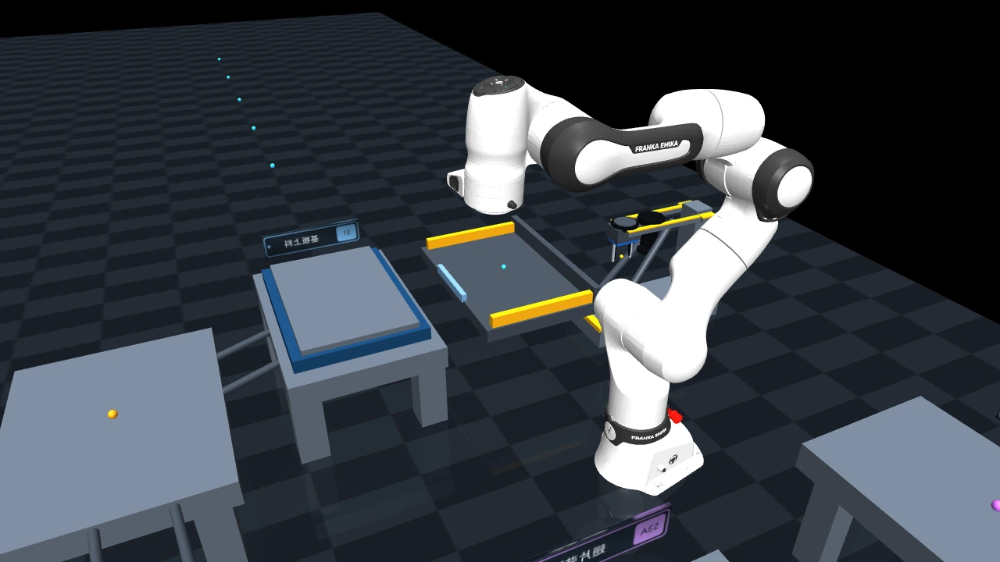<br><sub>吸盘变色确认吸附，携板平移并缓慢对准托盘</sub></td>
  </tr>
  <tr>
    <td align="center"><strong>③ Arm2 蛇形涂覆</strong><br>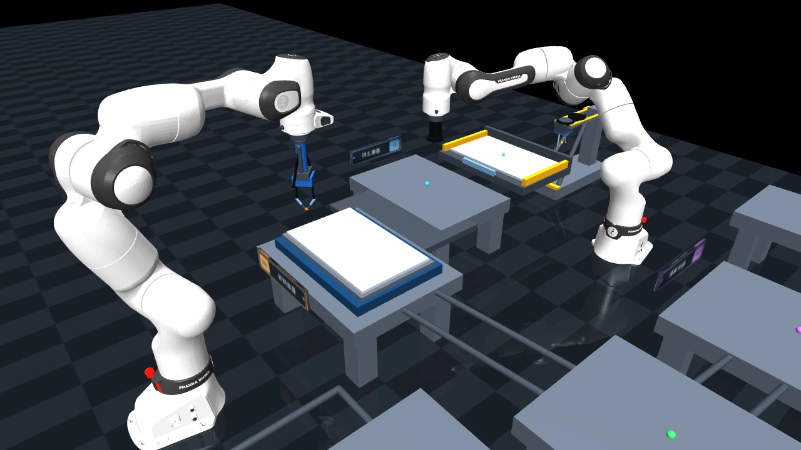<br><sub>奇偶路径反向扫描，已完成钎料线不会消失</sub></td>
    <td align="center"><strong>④ Arm1 + Arm3 双线安装</strong><br>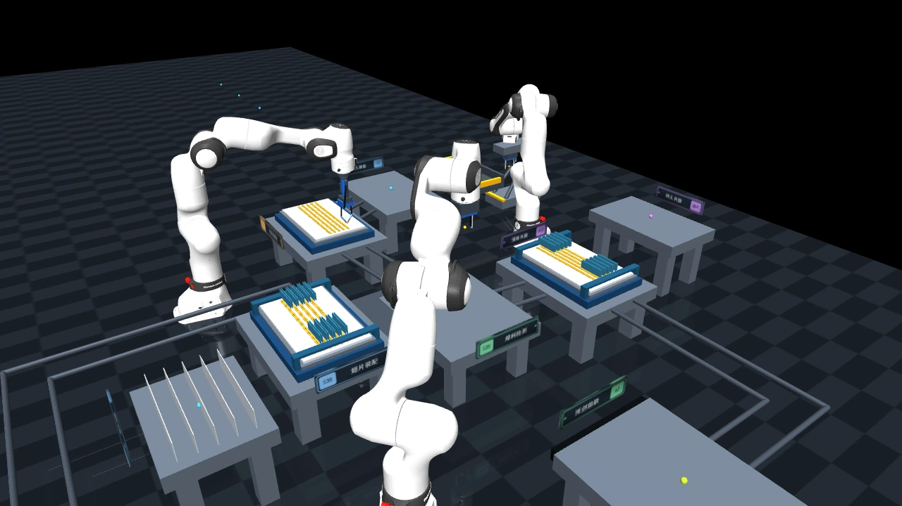<br><sub>两张托盘独立装配，检测任务保持优先</sub></td>
  </tr>
  <tr>
    <td align="center"><strong>⑤ 漏涂形成与相机检出</strong><br>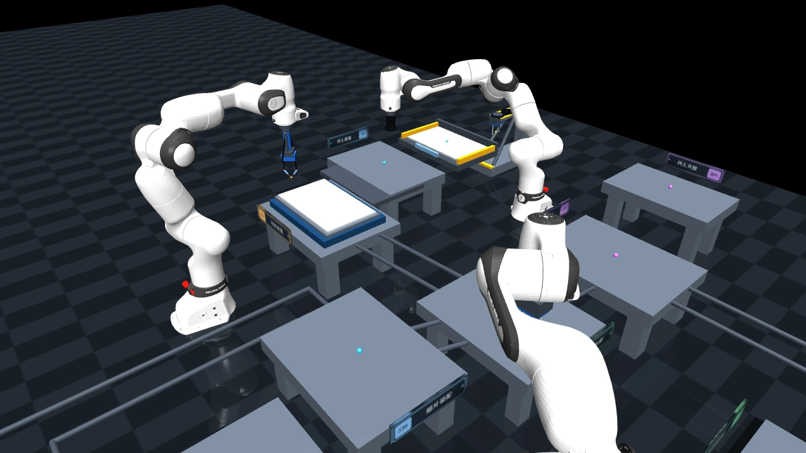<br><sub>缺口在涂覆时真实形成，送达 S2B 后才被识别</sub></td>
    <td align="center"><strong>⑥ 炉后卸料与成品交付</strong><br>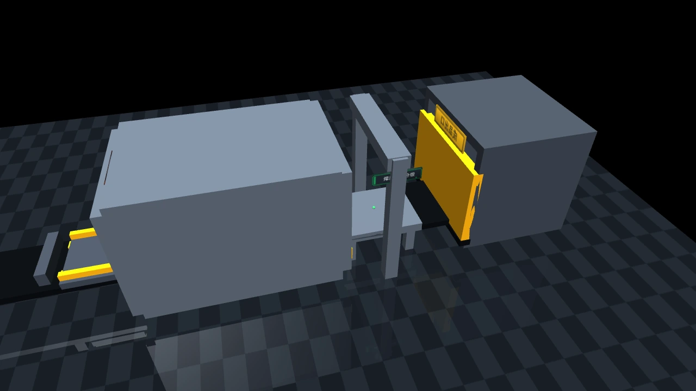<br><sub>后门打开、逐层卸料、焊后检测、黄色出口交付</sub></td>
  </tr>
</table>

<details>
<summary><strong>GIF 备用链接与素材复现命令</strong></summary>

- [换刀 GIF](docs/images/readme/v2_tool_change_process.gif) · [基板上料 GIF](docs/images/readme/v2_base_loading_process.gif)
- [涂覆 GIF](docs/images/readme/v2_dispensing_process.gif) · [并行安装 GIF](docs/images/readme/v2_parallel_install_process.gif)
- [故障检出 GIF](docs/images/readme/v2_fault_detection_process.gif) · [炉后交付 GIF](docs/images/readme/v2_furnace_delivery_process.gif)

```bash
python scripts/capture_readme_gifs.py
```

脚本从真实 V2 运行时的任务、物理故障与炉体状态自动确定截取时刻，以 1280×720、
4× 离屏抗锯齿重新生成高清 WebP 和 GIF。

</details>

<p align="right"><a href="#top">回到顶部 ↑</a></p>

## 🏭 一张图看懂制造闭环

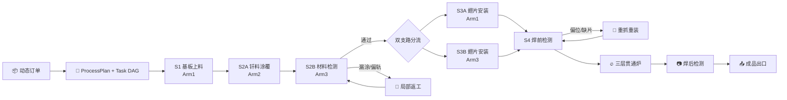

<a id="scene-gallery"></a>

## 🖼️ 当前真实工位图库

所有图片均由当前代码运行到对应工序后自动抓取，不是手工摆放模型。

| 快换架与基板上料 | 钎料涂覆与材料检测 |
|:---:|:---:|
| 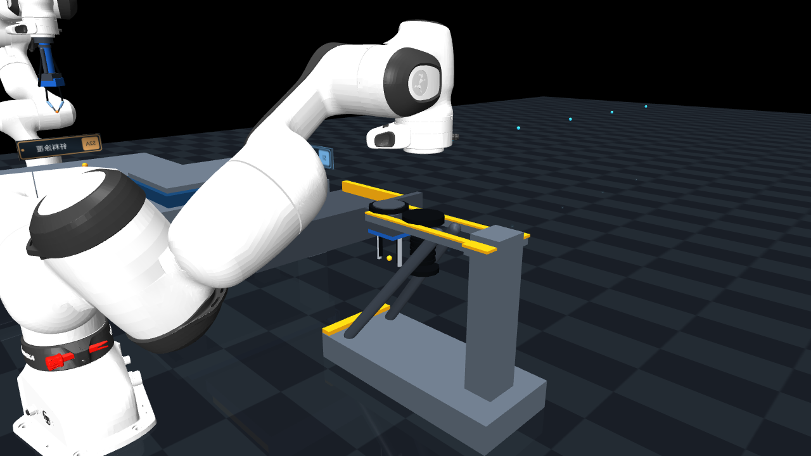 |  |
| 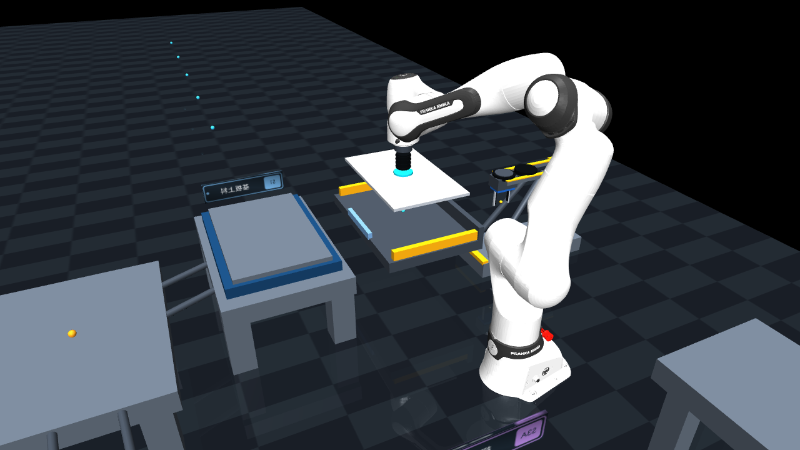 | 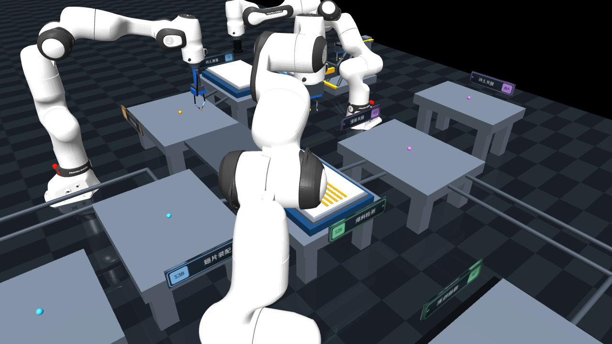 |

| 双支路翅片安装 | 共享焊前检测 |
|:---:|:---:|
|  | 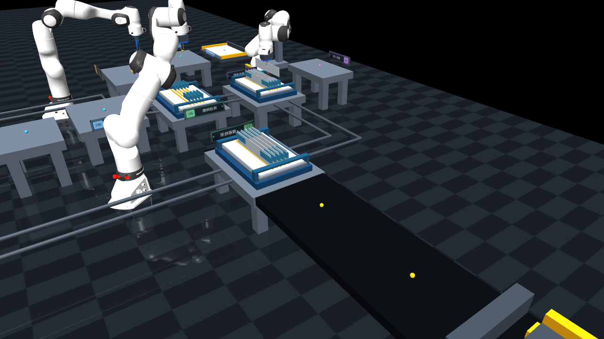 |

| 三层炉批热循环 | 后门逐层卸料 |
|:---:|:---:|
|  | 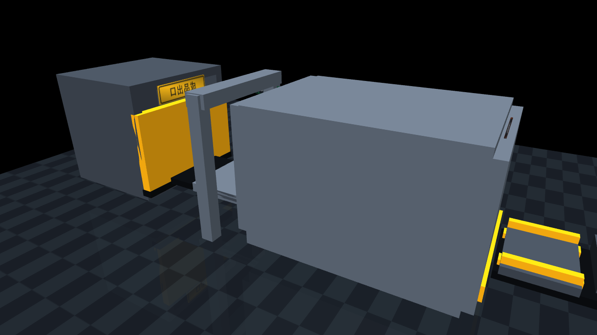 |

| 焊后固定检测 | 黄色成品出口 |
|:---:|:---:|
| 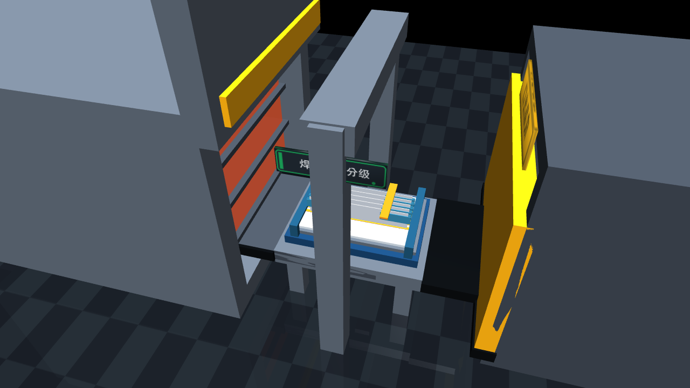 |  |

<details>
<summary><strong>展开 V1 / V2 四组场景对照</strong></summary>

| 工序 | 稳定 V1 | 当前 V2 |
|---|:---:|:---:|
| 总体布局 |  |  |
| 钎料涂覆 |  |  |
| 翅片安装 |  |  |
| 炉体与交付 |  |  |
| 成品出口 |  |  |

</details>

<p align="right"><a href="#top">回到顶部 ↑</a></p>

<a id="flexibility"></a>

## 🧩 柔性体现在哪里？

| 柔性 | 用户改变什么 | 系统真实改变什么 |
|---|---|---|
| 📦 **产品柔性** | A/B/C/D、基板、翅片数、节距、路径、配方 | 产品几何、梳齿、钎料路径、节拍与任务 DAG |
| 🧠 **调度柔性** | 多订单、紧急度、交期、到达顺序 | READY 放行、Arm1/Arm3 分工、工具驻留、工位与通道预约 |
| 🛠️ **恢复柔性** | 漏涂、偏轨、偏位、离线、输送/炉门异常 | 可见缺陷、相机检出、局部返工、安全人工审核 |
| 🔥 **批次柔性** | 1～6 件滚动到达、配方与层位占用 | 单件先入空层、三层兼容成批、下一炉批继续排队 |

### 产品不是“换名字”，故障也不是“弹提示”

| 钎料局部漏涂 | 翅片横向偏位 |
|:---:|:---:|
| 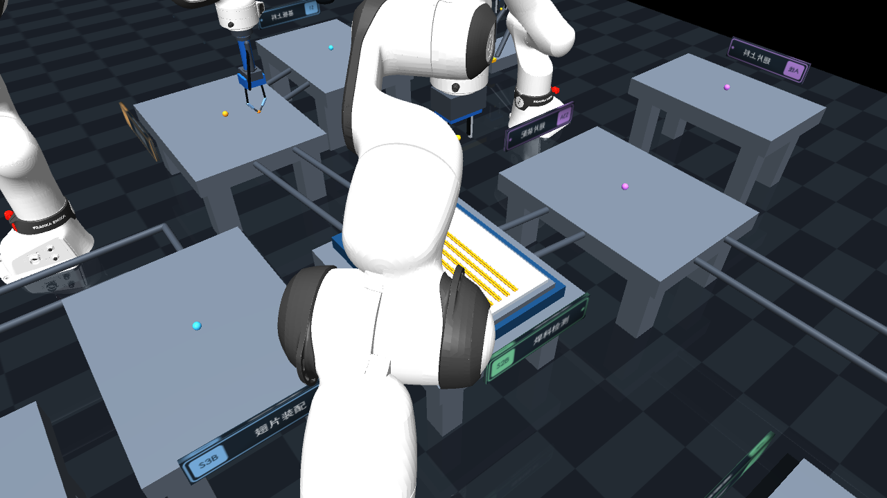 | 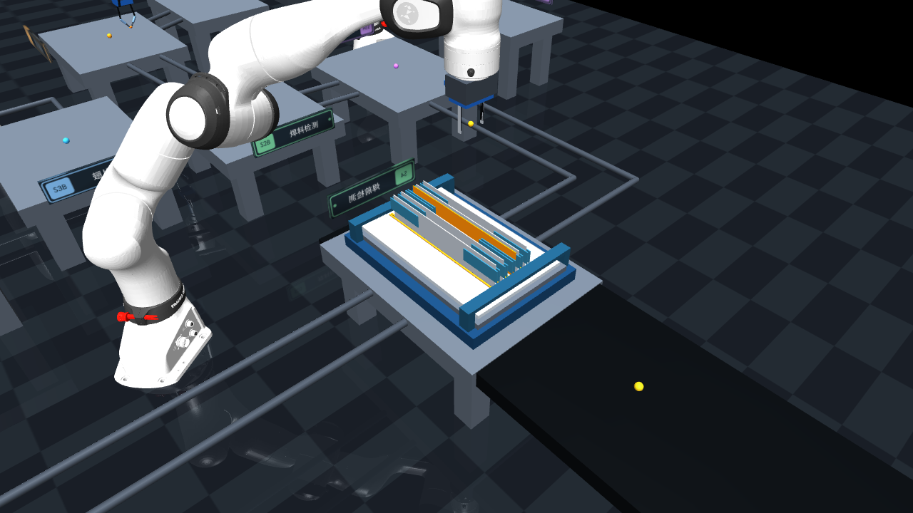 |
| 完好钎料在返程中保留，Arm2 只补缺口 | 偏位从安装下降阶段形成，到 S4 后才被相机确认 |

### 六订单时，Arm1 不再机械地来回换刀

- 吸盘最多连续处理一个受控微批次，再重新评估已就绪翅片任务。
- 如果最后一批基板已经装完，Arm1 会提前换成夹爪等待即将到达的安装托盘。
- 托盘运输期间，机器人可以先去安全接近点预定位，不必等输送完全结束才开始动。
- 工具收益不能绕过托盘所有权、通道预约、检测优先和炉门互锁。

<details>
<summary><strong>当前边界：哪些能力不会被 README 夸大？</strong></summary>

- V1 保留稳定单安装线；V2 是六托盘、双安装支路的推荐入口。
- 自定义订单必须通过实体容量与路径边界校验；最多 12 片翅片、24 条涂覆路径。
- 当前使用参数化工装状态与换刀架，不建设“自动换型龙门”概念动画。
- `0.25×～32×` 只改变推进速度，不改变依赖、质量结果或炉体安全条件。
- 未接入物理 actor 的规划算法不会在 README 中宣称为已经控制 MuJoCo。

</details>

## 🛡️ Phase 6–8：从“能跑”到“可证明”

### Phase 6｜安全屏障逐段强制

每条机械臂候选轨迹都会进行关节与时间双重采样（≤20 ms），并记录预测最小净空。
低于 40 mm 时，`FORCE` 模式会拒绝提交并把任务留在 READY，返回资源、原因和预约信息；
`SHADOW` 模式只记录风险，用于安全消融实验。状态可通过
`GET /safety/barrier` 查看，预约通过 `GET /motion/reservations` 查看。

### Phase 7｜真实替代路线与驾驶舱证据

订单的 OR 路线先由能力目录筛选，再在提交边界绑定具体资源；任务会写入
`selected_alternative` 和选择原因，甘特图、任务图和 `/state` 读取同一份事实。
因此“候选路线”不会停留在 UI 装饰：选中的 Arm1/Arm3、节拍和拒绝原因都能追溯。

### Phase 8｜竞赛版冻结

冻结阶段只做复现、回归、性能对照和素材更新。每次发布保留原始 JSON/CSV、运行配置、代码版本
和失败样本；当前复测明确显示 V2 仍有物理节拍优化空间，后续结果会继续以可复现实验为准。

<a id="performance"></a>

## 📊 2026-09-01 Phase 8：当前 V2 自身效率记录

同一台 Apple Silicon Mac，headless **快速回归模式 (`--fast`)**；仿真时间来自真实完工事件，
墙钟时间来自端到端进程计时。下表是 V2 在不同订单组合下的可复现记录，
用于观察并行度、扩展性和回归变化，不把加速模式冒充真实生产节拍。

| 订单场景 | V2 makespan | 件数 | V2 吞吐 | 并行安装区间 |
|---|---:|---:|---:|---:|
| 单件 A | **98.90 s** | 1 | 36.40 件/h | — |
| 三件 A | **173.35 s** | 3 | 62.30 件/h | 23.90 s |
| A/B/C 各一件 | **169.35 s** | 3 | 63.77 件/h | 23.90 s |
| A/B/C 各两件 | **271.90 s** | 6 | 79.44 件/h | 47.80 s |

> 这组数据建议结合上表阅读：在同一 V2 配置内，订单数增加时吞吐提升，说明滚动
> 托盘和双安装支路确实产生了并行收益；它不是跨版本排名。

### V1 数字应该怎样读？

仓库仍保留 V1 的原始结果，目的是确认旧入口没有被新代码破坏。由于 V1 是单线、
固定节拍、较少互锁和较少物理确认的演示流程，它天然会更快；这不是 V2 的公平对照，
也不能据此推断两套方案的真实产能差异。

下一轮公平实验将固定：同一订单几何、同一翅片/钎料数量、同一运输距离、同一炉体
装卸规则、同一完成定义，并分别报告仿真 makespan、墙钟耗时、机器人利用率、等待、
检测/恢复开销和安全屏障开销。

- [V1/V2 非等价回归原始 JSON](benchmarks/results/2026-08-12-current-v1-v2/metrics.json)
- [V1/V2 非等价回归说明](benchmarks/results/2026-08-12-current-v1-v2/summary.md)
- [六订单滚动流水原始数据](benchmarks/results/2026-08-12-six-order/metrics.json)
- [Phase 8 最新复测 JSON](benchmarks/results/2026-09-01-phase8/metrics.json)
- [Phase 8 最新复测摘要](benchmarks/results/2026-09-01-phase8/summary.md)
- 复现脚本：[benchmarks/compare_versions.py](benchmarks/compare_versions.py)

<details>
<summary><strong>黄金实验：调度、资源、排序与恢复的单变量对照</strong></summary>

固定种子 `42` 的四组逻辑实验仍保留完整原始事件：

| 问题 | 基线 → 候选 | 结果 |
|---|---|---:|
| 动态调度是否有效？ | 固定顺序 → 动态优先级 | makespan ↓ 31.77% |
| 多一个安装资源一定更快吗？ | 仅 Arm1 → Arm1 + Arm3 | makespan ↑ 1.82% |
| 同族排序是否减少切换？ | ABA → AAB | makespan ↓ 8.70% |
| 自动恢复是否减少停顿？ | 自动纠偏 → 10 s 人工 | 人工方案 ↑ 12.74% |

第二组负结果被保留：Arm3 的检测争用可能抵消安装并行收益，说明调度必须优化时窗，
不能简单地把“机器人更多”写成“必然更快”。

[查看黄金实验报告](docs/competition/柔性制造黄金实验报告.md)

</details>

<p align="right"><a href="#top">回到顶部 ↑</a></p>

<a id="quick-start"></a>

## 🚀 三步运行

```bash
# 1. 克隆项目
git clone https://github.com/w-mone-y/Flexible-process-for-heat-sinks-based-on-FR3.git
cd Flexible-process-for-heat-sinks-based-on-FR3

# 2. 安装运行与开发依赖
python -m pip install -e '.[dev,ui]'

# 3. 启动推荐的 V2 Viewer + Qt 控制台
mjpython brazing_line_v2.py
```

在 UI 中点击“加入普通订单 / 加入紧急订单”，或直接运行：

```bash
# 混合三订单完整物理流水
python brazing_line_v2.py --headless --orders A,B,C --max-sim-time 2000

# 六订单滚动 WIP + 两个三层炉批
python brazing_line_v2.py --headless --orders A,B,C,A,B,C --max-sim-time 2000

# 稳定 V1
mjpython brazing_line.py
```

<details>
<summary><strong>Windows、YAML 自定义订单与倍速命令</strong></summary>

```powershell
pwsh -NoProfile -ExecutionPolicy Bypass -File .\run_v2_windows.ps1
```

```bash
# 自定义订单 dry-run
python flexible_brazing.py --order config/orders/order_001.yaml --dry-run

# V2 图形模式直接加载订单
mjpython brazing_line_v2.py --orders A,B,C

# 32× 只改变推进速度，不改变任务结果
python brazing_line_v2.py --headless --orders A,B,C --fast
```

</details>

## 🖥️ Qt 控制台能做什么？

| 页面 | 直接用途 |
|---|---|
| 📦 订单规划 | A/B/C/D、合法自定义参数、普通/紧急插单、拒绝原因 |
| 🧠 任务图/调度 | 实时任务状态、托盘/工位筛选、阻塞原因、调度解释 |
| 🛠️ 故障与恢复 | 中文故障注入、物理表现、检测事件、返工/人工审核 |
| 🔥 批次与物流 | 六托盘所有权、三层炉批、门/升降台/出料状态 |
| 📈 实验指标 | makespan、吞吐、资源利用、等待与恢复事件 |

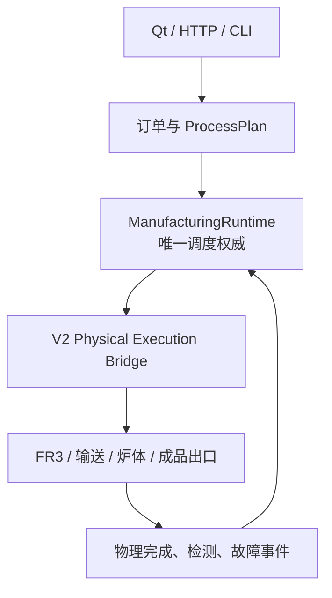

<a id="project-map"></a>

## 🗺️ 项目地图

```text
.
├── brazing_line.py / brazing_line_v2.py   # V1 / V2 入口
├── brazing_sim/
│   ├── dual_line/                         # V2 actor、物流、炉体与物理桥
│   ├── scheduling/                        # 动态调度与 Arm1 工具驻留策略
│   ├── planning/                          # ProcessPlan / Task DAG
│   └── recovery/                          # 故障、检测与恢复策略
├── scenes/production/                     # V1 / V2 MJCF
├── config/                                # 产品、订单、路线、能力、故障配置
├── scripts/                               # README 截图/动图等维护脚本
├── benchmarks/                            # 可复现实验与原始数据
├── tests/v1/ + tests/v2/                  # 兼容、物理与调度回归
└── docs/                                  # ADR、比赛材料、规格与架构文档
```

| 想了解…… | 从这里进入 |
|---|---|
| 项目目录与模块职责 | [项目目录说明](docs/architecture/项目目录说明.md) |
| 领域术语与不变量 | [CONTEXT.md](CONTEXT.md) |
| V2 双线场景与运行时 | [brazing_sim/dual_line/](brazing_sim/dual_line/) |
| 柔性规划与调度 | [docs/architecture/](docs/architecture/) |
| 比赛需求与验证 | [docs/competition/](docs/competition/) |
| 历史决策 | [docs/adr/](docs/adr/) |

## ✅ 验证

```bash
# 完整回归
pytest -q

# 静态检查
ruff check .
black --check .

# 重拍当前静态图与动图
python scripts/capture_v2_readme.py
python scripts/capture_readme_gifs.py
```

当前发布前验证已覆盖 Phase 6–8 的安全屏障、替代路线、V2 运行时和素材复测，
并通过 Ruff、Black、`compileall` 与 `git diff --check`。完整回归中仍有少量旧的
V2 物理时序测试待修复，因此这里不再使用“全部测试通过”的笼统表述；V1/V2、A/B/C、
1～6 订单、故障恢复、暂停/继续/重置、Viewer/headless 和 0.25×～32× 均保留覆盖。

---

<div align="center">

### 🌟 如果这个项目对你有帮助，欢迎 Star、Fork 或建立分支继续研究

[回到顶部 ↑](#top)

</div>
