<a id="top"></a>

<div align="center">

# 🔥 FR3 多机械臂柔性钎焊产线仿真

**用三台 Franka Research 3，在 MuJoCo 中完成散热片从订单到交付的完整制造闭环**

<p>
  <a href="pyproject.toml"></a>
  <a href="https://mujoco.org/"></a>
  <a href="assets/robots/fr3/README.md"></a>
  <a href="config/products/"></a>
  <a href="tests/v1/test_simulation_speed.py"></a>
  <a href="LICENSE"></a>
</p>

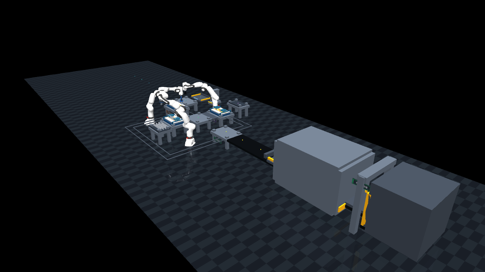

<p>
  <a href="#quick-start"><strong>快速体验</strong></a> ·
  <a href="#version-choice">版本选择</a> ·
  <a href="#screenshots">真实画面</a> ·
  <a href="#benchmark">效率数据</a> ·
  <a href="#documentation">文档地图</a> ·
  <a href="#quality">测试验证</a>
</p>

</div>

---

## 🧭 从这里开始

| 你现在想做什么？ | 最短入口 |
|---|---|
| ▶️ **第一次运行项目** | [三步启动 Viewer](#quick-start) |
| 🔀 **体验多订单双支路 V2** | [选择 V2 并运行 A/B/C](#version-choice) |
| 🎬 **先看真实仿真效果** | [V1 / V2 实际画面对照](#screenshots) |
| 📈 **查看效率是否真的提升** | [V1 / V2 实测数据](#benchmark) |
| 🧠 **理解调度、任务图与恢复** | [多订单协同](#multi-order) · [软件架构](#architecture) |
| 🧩 **准备修改场景或代码** | [文档与源码导航](#documentation) · [项目目录说明](docs/architecture/项目目录说明.md) |
| ✅ **验证修改没有破坏流程** | [测试与质量门槛](#quality) |

> **只想最快看到效果？** macOS/Linux 运行 `mjpython brazing_line_v2.py`；Windows
> 运行 `powershell -ExecutionPolicy Bypass -File .\run_v2_windows.ps1`，再从 Qt 控制台加入
> A/B/C 普通订单即可。

## 👀 30 秒看懂这个项目

这是一个面向低压配电柜散热组件的柔性制造仿真 MVP。用户提交 A、B、C 或 YAML
自定义订单后，系统会自动生成产品几何、钎料路径、工装选择、任务图和料架分配，
再由三台 FR3 协作完成：

| 机械臂 | 主要职责 | 仿真中的可见动作 |
|:---:|---|---|
| 🦾 **Arm1** | 基板上料、翅片抓取与安装 | 吸盘/夹爪换刀、渐进夹紧、逐片插入梳齿槽 |
| 🦾 **Arm2** | 钎料预涂与局部补涂 | 双喷嘴蛇形涂覆、逐条生成黄色钎料线 |
| 📷 **Arm3** | 检测优先，空闲时参与 B 线翅片安装 | 侧置相机扫描、窄夹爪抓取、逐片安装与复检 |

系统不只“播放动画”，还同时维护任务 DAG、资源占用、区域锁、工件真值、返工次数、
炉门互锁、托盘所有权和 KPI。故障会真实改变 MuJoCo 中的几何或设备状态，检测之后才会
触发对应恢复流程。

### ✨ 核心能力

- 📦 **订单参数驱动**：A/B/C 物理订单与严格 YAML 配置共用一套执行主线，D 型用于验证免改代码扩展。
- 🧩 **订单驱动工装**：15/20/30 mm 梳齿、短压梁和托盘随产品参数变化，并记录序列相关换型成本。
- 🔀 **多订单异步流水**：V1 三托盘、V2 六托盘 WIP，不同机械臂可在不同工位并行。
- 🧠 **任务图动态调度**：`ProcessPlan → Task DAG → Scheduler → Skills`。
- 🛠️ **可见故障与恢复**：漏涂、偏位、设备离线、输送超时、炉门互锁等。
- 🔥 **完整炉体闭环**：三层前门装炉、30 秒演示热循环、后门卸载、检测与交付。
- 🖥️ **规划控制台**：订单、任务图、工程示意、资源、故障、物流与实验指标。
- ⚡ **0.25×～32× 倍速**：只改变仿真推进速度，不改变任务依赖与质量结果。

### 当前能力边界（避免把规划能力当成物理能力）

| 能力 | V1 稳定线 | V2 双安装线 | 当前边界 |
|---|:---:|:---:|---|
| A/B/C 实体订单 | ✅ | ✅ | 共用产品与配方语义，使用独立物理运行时 |
| D 型 / 自定义 YAML | ✅ 规划与 dry-run | ⚠️ 规划可见、实体执行未开放 | 无实体模块或超容量时在启动前拒绝 |
| 多订单协同 | ✅ 三托盘 | ✅ 六托盘、双安装支路 | 单炉最多三件，超出 WIP 的订单留在虚拟队列 |
| 可见故障与返工 | ✅ | ✅ | 质量故障由相机检出后返工；安全故障不能自动绕过 |
| 动态任务 DAG | ✅ | ⚠️ V2 使用异步阶段状态机 | V2 UI 会实时投影物理任务，但不是同一套 DAG 执行器 |
| 自动换型规划与 KPI | ✅ | ✅ 展示 | 换型动作与成本已建模；实体换型龙门仍是后续工作 |

> `✅` 表示当前代码和回归测试覆盖；`⚠️` 表示已具备规划、展示或部分执行能力，
> 但仍保留明确的物理边界。项目不会用动画或 UI 文案冒充尚未接通的 actor。

## 🏭 一张图看懂生产流程

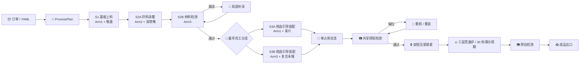

V2 采用从左向右的双安装支路布局；稳定 V1 仍保留浅 U 形单安装支路：

```text
S1 基板装载 → S2A 钎料涂覆 → S2B 焊料检测
                                  ├→ S3A Arm1 安装 ┐
                                  └→ S3B Arm3 安装 ┴→ S4 共享检测
                                                     → 三位炉前缓存
                                                     → 三层贯通炉
                                                     → 固定焊后检测
                                                     → 成品出口
```

<a id="screenshots"></a>

## 🎬 真实仿真画面

| 稳定 V1 单安装线 | V2 双安装线 |
|:---:|:---:|
| 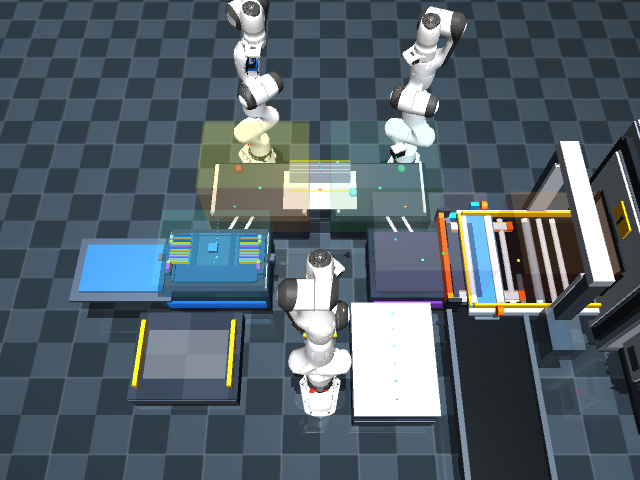 |  |
| 完整故障恢复、物理夹具和旧入口兼容基线 | Arm1/Arm3 并行安装、单占用合流和前装后卸三层炉 |

<details>
<summary><strong>展开查看 4 组关键工序的 V1 / V2 实际画面对照</strong></summary>

### 1. Arm2 逐条涂覆

| V1 稳定基线 | V2 双安装线 |
|:---:|:---:|
| 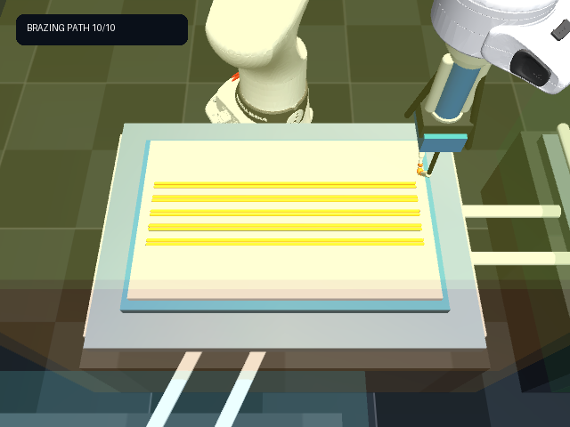 | 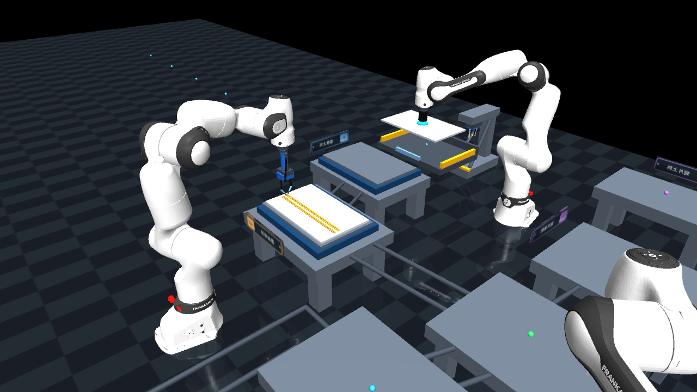 |
| 双喷嘴沿蛇形路径逐条生成黄色钎料线 | 复用 V1 的连续直线涂覆逻辑，并允许下一张托盘并行流动 |

### 2. 梳齿引导翅片安装

| V1 单安装工位 | V2 双安装支路 |
|:---:|:---:|
| 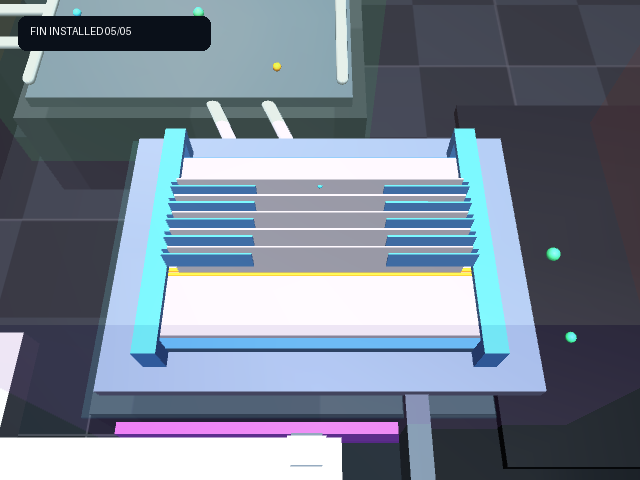 | 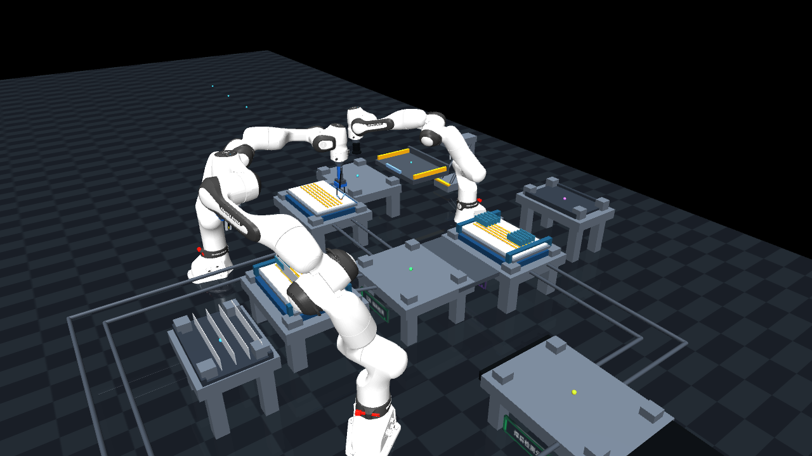 |
| Arm1 逐片送入前后悬空梳齿槽 | Arm1 与 Arm3 在两张独立托盘上同时逐片安装 |

### 3. 三层炉批热循环

| V1 三层炉 | V2 前进后出贯通炉 |
|:---:|:---:|
| 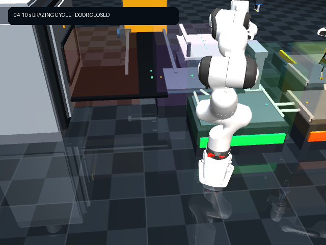 | 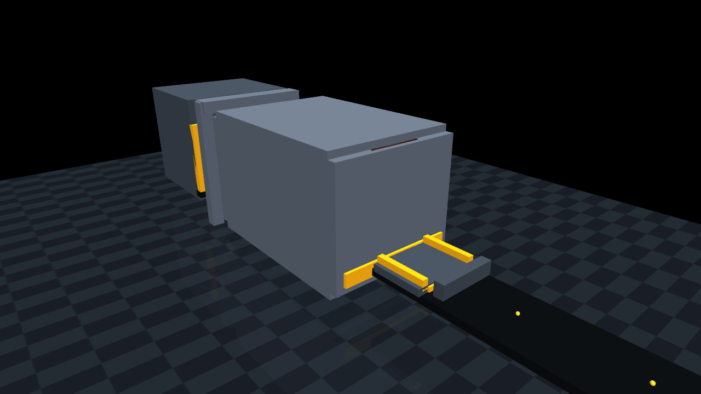 |
| 三层料架锁定后执行一次批次热循环 | 托盘逐件从前门装入，三层满载后关门执行兼容炉批 |

### 4. 成品出口交付

| V1 黄色升降门出口 | V2 封闭式黄色升降门出口 |
|:---:|:---:|
| 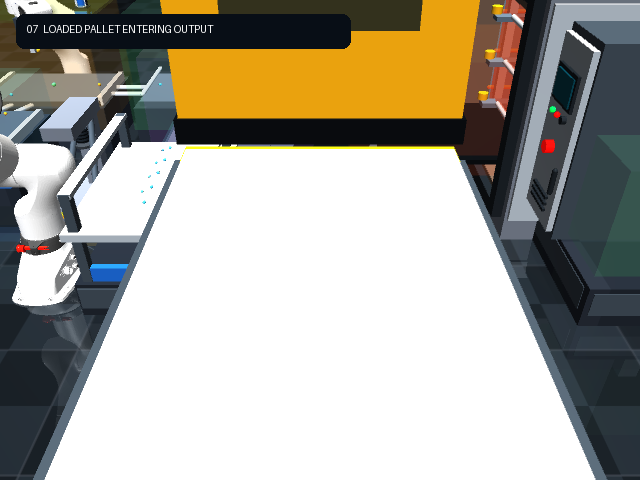 | 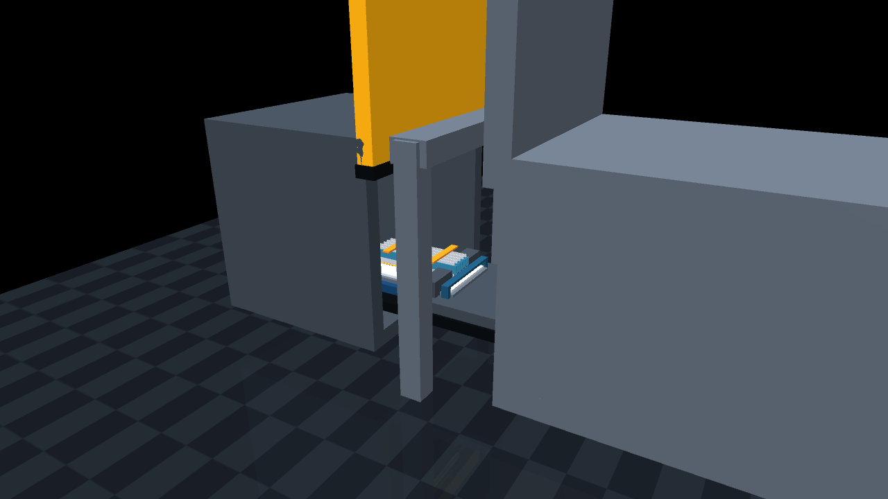 |
| 门完全打开后整托盘进入，随后关门并隐藏产品 | 后门退完全部托盘才关闭；黄色门打开后托盘进入封闭箱体 |

> 所有图片均来自项目实际 MuJoCo 流程，不是概念效果图。V2 图片来自修复后的
> 同一组三件 A 实际运行：后门遵循“完全打开 → 三张托盘逐层退架 → 最后一张
> 完全离炉 → 关闭”，成品出口遵循“黄色门打开 → 托盘进入 → 关门 → 虚拟回流”。

</details>

<p align="right"><a href="#top">回到顶部 ↑</a></p>

<a id="quick-start"></a>

## 🚀 快速开始

下面的命令均从仓库根目录执行。第一次使用建议先运行 V2 Viewer；需要完整故障恢复时再
切换稳定 V1。

<a id="version-choice"></a>

### 0. 先选择适合你的版本

| 入口 | 适合场景 | 一条命令 |
|---|---|---|
| **V2 双安装线**（推荐体验） | 多订单、Arm1/Arm3 并行装配、前进后出三层炉 | macOS/Linux: `mjpython brazing_line_v2.py`；Windows: `powershell -ExecutionPolicy Bypass -File .\run_v2_windows.ps1` |
| **V1 稳定线** | 完整故障注入、自动恢复、单段演示和旧入口兼容 | `mjpython brazing_line.py` |
| **精细视觉版** | 截图、录屏和展示 | `mjpython brazing_line_cinematic.py --order A` |
| **YAML 柔性订单** | 配置驱动、自定义计划、dry-run 和调度实验 | `python run_flexible_order.py --order config/orders/order_001.yaml --dry-run` |

### 1. 环境要求

- Python 3.10+
- MuJoCo 3.1+
- NumPy、PyYAML
- PySide6（可选，用于 Qt 规划控制台）
- macOS 图形模式建议使用 `mjpython`
- Windows V2 使用 Conda 环境 `wy`，启动脚本不会调用全局 Python，也不会安装依赖

### 2. 三步启动

```bash
# 1. 克隆并进入仓库
git clone https://github.com/w-mone-y/Flexible-process-for-heat-sinks-based-on-FR3.git
cd Flexible-process-for-heat-sinks-based-on-FR3

# 2. 安装运行时、Qt UI 和开发依赖
make install-dev

# 3. 启动推荐的 V2 Viewer + Qt 控制台
mjpython brazing_line_v2.py
```

### Windows V2 启动

Windows V2 固定通过已有的 Conda 环境 `wy` 运行。PowerShell 当前 PATH 没有 `conda` 时，
脚本也会尝试常见的 Conda 安装位置；找不到环境或运行库时只报告错误，不执行安装。

```powershell
# 在仓库根目录执行；首次使用可只对当前进程放宽脚本策略
powershell -ExecutionPolicy Bypass -File .\run_v2_windows.ps1

# 带订单运行 Viewer + Qt 控制台
powershell -ExecutionPolicy Bypass -File .\run_v2_windows.ps1 --orders A,B,C --fast

# 只运行 V2 headless，不创建 Viewer 或 Qt 窗口
powershell -ExecutionPolicy Bypass -File .\run_v2_windows.ps1 --headless --orders A,B,C --fast
```

Windows Viewer 的交互约定：左键拖动旋转，右键或中键拖动平移，鼠标滚轮或捏合缩放，
触摸板两指滑动前后左右平移；方向键/WASD 也可平移，`R` 恢复初始视角。滚轮/捏合向上
为放大，向下为缩小。

若提示缺少 `mujoco`、`PySide6` 或其他模块，请确认模块安装在 `wy` 环境中，并用
`conda run -n wy python -c "import mujoco, PySide6"` 检查；不要改用全局 Python。

### 3. 启动稳定 V1

```bash
# 打开 MuJoCo Viewer 与 Qt 控制台，再从 UI 加入订单
mjpython brazing_line.py

# 直接运行指定订单
mjpython brazing_line.py --order A
mjpython brazing_line.py --order B
mjpython brazing_line.py --order C

# 三件 A 型三层批次
mjpython brazing_line.py --batch A
```

### 4. V2 双安装支路

V2 使用独立入口和独立 MJCF，不覆盖 V1。它提供六托盘、Arm1/Arm3 双翅片
安装支路、Y 形合流、三层贯通炉（前门装载、后门卸载）以及相同的十页签 Qt
控制台。

```bash
# Viewer 空载启动，再从 UI 加入 A/B/C 普通或紧急订单
mjpython brazing_line_v2.py

# Headless 运行混合三订单
python brazing_line_v2.py --headless --orders A,B,C --fast
```

> V2 已接通机器人动作、抓取、工位运输、三层炉批、实时任务投影，以及质量/设备
> 故障的“物理形成 → 检测 → 实体返工或安全保持”。当前仍未开放 V2 自定义产品实体
> 执行、九个单段 actor 和可见换型龙门；界面会明确禁用或提示，不会静默假装成功。
> 完整边界见 [V2 规格](docs/specs/v2-dual-install-line.md)与
> [V2 扰动柔性说明](docs/specs/v2-disturbance-flexibility.md)。

### 5. YAML 柔性订单

```bash
# 只加载、生成和校验计划，不启动 MuJoCo
python run_flexible_order.py \
  --order config/orders/order_001.yaml \
  --dry-run

# 图形模式
python run_flexible_order.py \
  --order config/orders/order_002.yaml

# 多订单动态调度
python run_flexible_order.py \
  --orders config/orders/batch_abc.yaml \
  --scheduler dynamic

# 无界面 32× 实验
python run_flexible_order.py \
  --orders config/orders/batch_abc.yaml \
  --scheduler dynamic \
  --headless --speed 32
```

<details>
<summary><strong>macOS 出现 mjpython / otool 状态码 69 怎么办？</strong></summary>

这通常表示当前机器尚未接受 Xcode License。只需执行一次：

```bash
sudo xcodebuild -license accept
otool -l "$(which python)" >/dev/null && echo "Xcode tools ready"
mjpython brazing_line.py
```

</details>

<p align="right"><a href="#top">回到顶部 ↑</a></p>

<a id="documentation"></a>

## 📚 文档与源码导航

### 按目标阅读

| 我想了解…… | 推荐入口 |
|---|---|
| 项目能做什么、如何运行 | [README 首页](README.md) · [文档总导航](docs/README.md) |
| V1、V2 有什么区别 | [V2 双安装线规格](docs/specs/v2-dual-install-line.md) · [V1/V2 实测报告](benchmarks/results/2026-07-29-v1-v2/comparison.md) |
| 文件应该去哪里找 | [项目目录说明](docs/architecture/项目目录说明.md) |
| 场景、网格和中文铭牌如何组织 | [视觉模型与资产说明](docs/architecture/视觉模型与资产说明.md) |
| Arm2 在完整工艺中的职责 | [Arm2 工艺说明](docs/process/Arm2%20在整体流程中的任务.md) |
| 工艺如何由 YAML 驱动、资源如何延迟绑定 | [数据驱动工艺与能力延迟绑定](docs/specs/capability-driven-flexibility.md) |
| 换型时间如何建模与度量 | [换型建模与 KPI](docs/specs/changeover-modelling.md) |
| V2 的故障注入与恢复如何工作 | [V2 扰动柔性与控制台接通](docs/specs/v2-disturbance-flexibility.md) |
| 项目的核心领域术语与不变量 | [领域上下文](CONTEXT.md) · [架构决策记录](docs/adr/) |

### 关键实现入口

| 模块 | 可点击源码 | 主要职责 |
|---|---|---|
| 路径管理 | [`brazing_sim/paths.py`](brazing_sim/paths.py) | 根目录、配置、场景、资产和输出路径 |
| 制造运行时 | [`manufacturing_runtime.py`](brazing_sim/manufacturing_runtime.py) | 订单队列、任务图、调度、事件和恢复 |
| 任务图构建 | [`task_graph_builder.py`](brazing_sim/planning/task_graph_builder.py) | 将产品工艺转换为依赖 DAG |
| V2 异步运行时 | [`dual_line/runtime.py`](brazing_sim/dual_line/runtime.py) | 双支路、六托盘、炉批与成品交付 |
| 物理技能 | [`async_line_skills.py`](brazing_sim/execution/async_line_skills.py) | Arm1/2/3 和工位动作适配 |
| MuJoCo 场景 | [`V1 XML`](scenes/production/brazing_line.xml) · [`V2 XML`](scenes/production/brazing_line_v2.xml) | 设备、机器人、托盘、约束与执行器 |
| 回归测试 | [`tests/`](tests/) | V1、V2、领域模型、场景和完整流程验证 |

> 新贡献者建议按[项目目录说明中的推荐阅读顺序](docs/architecture/项目目录说明.md#推荐阅读顺序)
> 阅读；其中每一项现在都可以直接点击跳转。

<p align="right"><a href="#top">回到顶部 ↑</a></p>

## 📦 柔性订单

| 产品 | 基板尺寸 | 翅片 | 节距 | 梳齿模块 | 钎料路径 | 压紧力 |
|:---:|---|---:|---:|---:|---:|---:|
| **A** | 0.36 × 0.22 × 0.008 m | 5 | 20 mm | 20 mm | 10 | 20 N |
| **B** | 0.36 × 0.24 × 0.008 m | 4 | 30 mm | 30 mm | 8 | 18 N |
| **C** | 0.34 × 0.20 × 0.008 m | 7 | 15 mm | 15 mm | 14 | 22 N |
| **D** | 0.36 × 0.24 × 0.008 m | 9 | 15 mm | 15 mm | 18 | 30 N |

> **D 型是换型免编程的证据**：加入它只需
> [`product_d.yaml`](config/products/product_d.yaml) 与
> [`order_004.yaml`](config/orders/order_004.yaml) 两个文件，没有一行 Python、
> 没有一处示教点。涂覆节拍自动由 24.0 s 增至 29.4 s，翅片检测由 10.0 s 增至
> 11.2 s，全部来自
> [能力本体](config/capabilities.yaml)的参数化节拍模型。

配置职责：

```text
config/products/          产品几何、翅片、喷嘴与压紧参数
config/orders/            数量、优先级、交期与首选料架层
config/capabilities.yaml  能力本体：工具类别、参数范围、参数化节拍、工艺谓词
config/routings/          产品工艺路线：工序、依赖与 OR 替代分支
config/fixture_modules.yaml
config/process_recipes.yaml
config/rack_config.yaml
config/resources.yaml     资源能力声明、节拍系数、参数窗口与工具类别
config/scheduler.yaml
```

规划层的工艺与资源均为数据：**加新产品 = 加一个 product/order YAML；加新工艺 =
扩展 routing 与 capability；注册同能力资源 = 加一个 resource 条目。** 新资源要参与
MuJoCo 实体动作时，仍必须提供对应 actor、可达性和安全验收，不能只改 YAML。
详见[数据驱动工艺与能力延迟绑定](docs/specs/capability-driven-flexibility.md)。

加载器采用严格校验。缺字段、未知字段、错误类型、负数、路径越界、超过 12 片翅片 /
24 条路径容量，或没有可用料架层，都会在机械臂运动前给出“文件 + 字段路径 + 原因”，
不会带着错误配置进入仿真。

<a id="multi-order"></a>

## 🔀 多订单协同

稳定 V1 使用三张在制托盘；V2 预分配六张托盘，允许“炉内最多三件 + 上游下一批
最多三件”。超出物理 WIP 的订单留在虚拟队列，托盘完成虚拟回流后再释放。

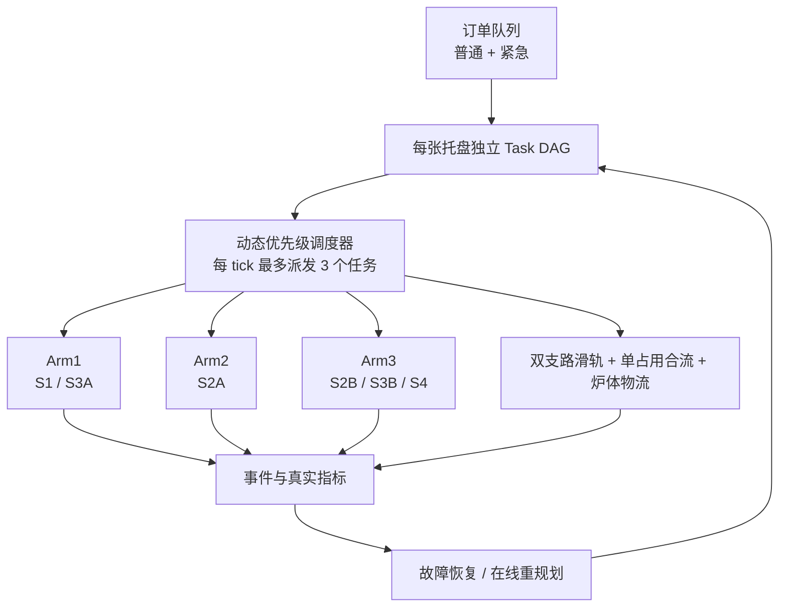

- V2 在 S2B 后按预计最早完工时间分配 Arm1-A 或 Arm3-B 安装支路。
- 托盘所有权按“源工位 → 输送段 → 目标工位”原子交接，禁止一托多属。
- Arm1 与 Arm3 可在两张托盘上同时逐片安装；Arm3 检测优先，已经夹住的单片不可抢占。
- 两条平面路线在 S4 前实施单占用合流，后到托盘在支路等待位停车。
- 紧急订单不会打断正在进行的抓取、涂覆或输送，只竞争下一次资源释放。
- 动态调度冲突会保持 READY 并等待，不会因为暂时无路可走就直接进入 ERROR。

<a id="benchmark"></a>

## 📈 V2 / V1 实测效率对比

2026-07-29 在同一台 macOS 工作站以 headless **完整运动模式**实测；未使用 `--fast`。
仿真 makespan 来自真实完工事件，墙钟来自进程端到端耗时。

| 场景 | V2 makespan | 正式 V1 | V2 改善 | V2 并行安装重叠 |
|---|---:|---:|---:|---:|
| 单件 A | 206.30 s | 256.97 s | **↓ 19.7%** | 0.00 s |
| 三件 A / 单炉批 | 359.25 s | 835.13 s | **↓ 57.0%** | 61.35 s |
| A/B/C 各一件 | 345.25 s | 562.44 s | **↓ 38.6%** | 86.60 s |

| 完工时间 | 多订单吞吐 |
|:---:|:---:|
| 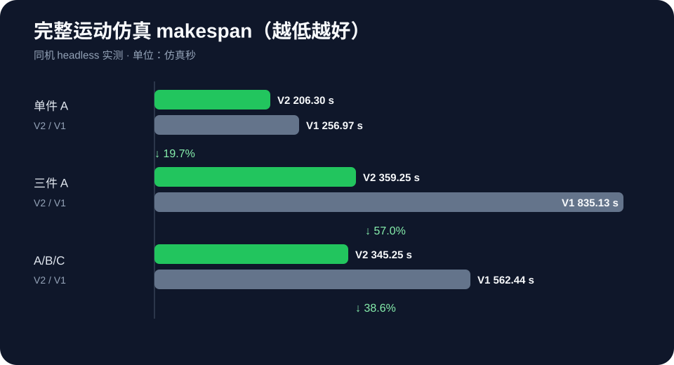 | 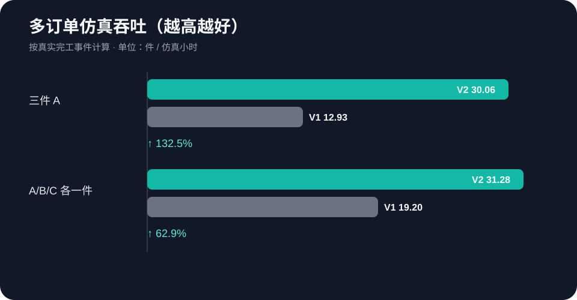 |

- 三件 A 的仿真吞吐由 **12.93 件/h** 提高到 **30.06 件/h**，提升 **132.5%**。
- 混合 A/B/C 的吞吐由 **19.20 件/h** 提高到 **31.28 件/h**，提升 **62.9%**。
- 早期 V1 只支持 A，完整单 A 在 333.63 s 触发炉体/Arm2 非预期接触并安全停机，
  因此不把快进时间包装成有效完工成绩。

> 这组 2026-07-29 历史基准采集于 `CONTROL_PLANE_REHEARSAL` 阶段，证明当时调度、
> 可见运输和双安装支路的相对效率收益；它不代表真实工厂节拍，也不替代当前版本的
> TCP、抓取、故障恢复与安全回归。复现实验会在新输出目录生成新的时间戳结果。

查看[完整报告、原始 JSON/CSV 与复现说明](benchmarks/results/2026-07-29-v1-v2/comparison.md)。

## 🛠️ 故障注入与自动恢复

Qt 的“故障与恢复规划”页可以直接选择中文故障、目标和严重程度。故障先发生在对应工序，
再由检测或监控发现，最后执行恢复；不会在“开始修复”时才突然生成缺陷。

| 故障 | MuJoCo 中的可见表现 | 默认恢复 |
|---|---|---|
| 钎料漏涂 | 黄色焊缝出现真实断口 | Arm3 检出 → Arm2 局部补涂 → 复检 |
| 钎料偏轨 | 实际焊缝偏移并显示红色标准线 | 重规划缺陷路径并补涂 |
| 翅片偏位 | 翅片发生真实平移或倾斜 | Arm1 重抓、重装并复检 |
| Arm 离线 | 对应机械臂停止并变红 | 停止派工，资源恢复后继续 |
| 输送超时 | 带面停在故障位置并变红 | 所有权确认、回零、重试一次 |
| 炉门互锁 | 炉门卡在半开位置 | 保持托盘锁定，恢复后重新检查互锁 |
| 炉温异常 | 热区与加热管颜色变化 | 输出返工或报废分级 |

每条返工路径具有次数上限，同一故障事件只插入一次恢复链。恢复不会重建 Viewer，
也不会清空无关订单和托盘。

## 🖥️ Qt 规划控制台

| 页签 | 可以做什么 |
|---|---|
| 📦 **订单规划** | 选择 A/B/C、数量、优先级、交期，预览并加入普通/紧急订单 |
| 🧠 **任务图 / 调度** | 查看实时 DAG、节点状态、依赖、资源和失败原因 |
| 📐 **产品工程图规划** | 查看俯视/正视/侧视尺寸示意，导出 PNG/SVG |
| 🚦 **资源与区域** | 查看机械臂、工具、炉体、输送和区域锁状态 |
| 🛠️ **故障与恢复规划** | 注入故障、查看恢复链、重试或转人工 |
| 🔥 **批次与物流** | 查看三层料架、炉门、托盘和成品出口 |
| 📊 **指标与实验** | 查看利用率、等待时间、吞吐、makespan 和调度对比 |

控制台还保留单独运行取放、检测 1、Arm2 涂覆、翅片安装、检测 2、直线入炉，
以及暂停、继续、复位、加速 ×2 和减速 ÷2。

<a id="architecture"></a>

## 🧠 软件架构

```text
订单队列
  ↓
ProcessPlan（产品几何 + 路径 + 工装 + 配方 + 层位）
  ↓
TaskGraph（每张托盘独立 DAG）
  ↓
FixedSequenceScheduler / DynamicPriorityScheduler
  ↓
SkillRegistry → Arm1 / Arm2 / Arm3 / 输送 / 炉体 actor
  ↓
事件总线 → 质量检测 → RecoveryPolicy → 在线重规划
  ↓
JSONL / CSV / KPI / Qt / HTTP API
```

<details>
<summary><strong>展开查看项目目录与模块职责</strong></summary>

```text
brazing_line.py               标准版兼容启动器
brazing_line_v2.py            双安装支路 V2 启动器
brazing_line_cinematic.py     精细版兼容启动器
run_flexible_order.py         YAML 订单兼容启动器
scenes/production/            标准版与精细版 MuJoCo 场景
assets/robots/fr3/            FR3 模型、网格和许可证
assets/signs/                 中文设备铭牌
config/                       产品、订单、配方、资源和调度配置
brazing_sim/
├── cli/                      三个启动器的真实实现
├── domain.py                 强类型订单、产品、任务和检测状态
├── flexible/                 配置加载、几何生成、工装和计划
├── changeover/               配置差分、序列相关换型成本与 KPI
├── planning/                 ManufacturingTask 与 TaskGraph
├── scheduling/               固定/动态调度、资源和区域锁
├── execution/                技能注册、actor 适配和超时监测
├── dual_line/                V2 拓扑、运行时、场景投影与机器人动作
├── recovery/                 故障模型、恢复策略和在线重规划
├── experiments/              事件指标与 fixed/dynamic 对比
├── flexibility_report.py     六类柔性能力与边界的可解释快照
├── motion.py                 FR3 控制、IK 与平滑轨迹
├── inspection.py             Arm3 检测姿态与相机几何
├── fixture.py                梳齿、压梁与力控压紧
├── async_line_router.py      四段输送与托盘所有权
├── batch_transfer.py         入炉、料架、出炉和成品交付
├── paths.py                  项目目录和主场景权威路径
└── api.py / ui.py            HTTP、终端与 Qt 控制台
benchmarks/                   V1/V2 可复现效率对照与精选结果
tests/
├── shared/                   跨版本领域测试
├── v1/                       标准线、柔性订单和旧入口回归
└── v2/                       双安装线、场景、调度与 UI 回归
```

</details>

更完整的中文职责说明见：

- [🧭 文档导航](docs/README.md)
- [📚 项目目录说明](docs/architecture/项目目录说明.md)
- [🎨 视觉模型与资产说明](docs/architecture/视觉模型与资产说明.md)

<details>
<summary><strong>展开查看关键物理与运动约束</strong></summary>

- 所有槽位、涂覆和检测姿态均由产品坐标生成，不为 A/B/C 分别硬编码世界坐标。
- 抓取、工具和托盘连接使用 MuJoCo `equality weld` 表达工艺约束。
- Arm1 抓取和放置阶段锁定第七关节；姿态调整必须在安全高度完成。
- 基板或翅片被抓住后保持世界姿态，最终 XY 对准后再垂直下降。
- 夹爪使用渐进闭合；释放后小幅张开并垂直撤离，避免碰撞相邻翅片。
- Arm2 使用永久安装的叉形双喷嘴，工具 Z 轴始终竖直向下。
- 奇数槽从 `-X` 到 `+X`，偶数槽反向，形成连续蛇形路径。
- 梳齿在材料检测通过后安装，短压梁在翅片检测通过后安装，避免喷嘴穿模。
- 压梁使用真实 slide joint、位置执行器、浮动关节和 touch sensor。
- 托盘、模板、梳齿、压梁、基板、翅片与钎料作为整体进出炉体。
- 出口门完全打开后产品才进入箱体；产品移交后空托盘沿原路径返回。
- `preflight_check()` 会在启动前检查 body/site/joint/actuator/sensor/weld 与可达性。

</details>

## 🎨 标准版与精细视觉版

| 版本 | 适用场景 | 特点 |
|---|---|---|
| **标准版** | 日常开发、调试、高倍速实验 | 更高 RTF，完整物理和任务逻辑 |
| **精细版** | 截图、录屏、项目展示 | 更细炉体/出口/喷管视觉层，4096 阴影与 4× MSAA |

```bash
# 标准版
mjpython brazing_line.py --order A

# 精细视觉版
mjpython brazing_line_cinematic.py --order A
mjpython brazing_line_cinematic.py --batch A
```

精细版只增加 `contype=0 / conaffinity=0` 的视觉几何，不改变碰撞、IK、状态机、
故障恢复和质量结果。

## 🌐 HTTP 与终端接口

<details>
<summary><strong>展开查看常用接口</strong></summary>

默认 HTTP 地址：V1 `127.0.0.1:8766`，V2 `127.0.0.1:8767`。

| 接口 | 作用 |
|---|---|
| `GET /state` | 订单、任务、机械臂、物流、炉体、质检和 KPI |
| `POST /order` | 启动 A/B/C 单订单 |
| `POST /orders/plan` | 校验并预览运行时订单 |
| `POST /orders/insert` | 加入普通或紧急订单 |
| `GET /tasks` / `/resources` / `/metrics` | 查询调度与实验状态 |
| `GET /fault-catalog` | 获取中文故障目录 |
| `POST /faults/inject` | 注入可见故障 |
| `POST /scheduler/replan` | 手动请求重新调度 |
| `POST /stop` / `/continue` / `/reset` | 暂停、继续和复位 |
| `POST /speed` | 当前速度加倍或减半 |

常用终端命令：

| 命令 | 作用 |
|---|---|
| `order_a` / `order_b` / `order_c` | 启动 A/B/C |
| `batch_a` | 启动三件 A 型批次 |
| `pick_place` / `arm2_motion` / `fin_assembly` | 单独播放关键工序 |
| `inspection_1` / `inspection_2` | 单独运行两类检测 |
| `rack_transfer` | 单独运行直线入炉 |
| `fault brazing_gap slot_02_left` | 注入局部漏涂 |
| `fault fin_pose fin_02` | 注入翅片偏位 |
| `status` / `stop` / `continue` / `reset` | 状态与流程控制 |

</details>

<a id="quality"></a>

## ✅ 测试与质量门槛

```bash
make check
make test
make test-v1
make test-headless
make test-batch
make test-flexible
make test-v2
make test-cinematic
make benchmark-help
```

测试覆盖严格 YAML、A/B/C 几何、12/24 对象池、动态喷嘴、梳齿选型、Arm1 抓取安装、
多托盘所有权、资源互斥、炉门互锁、暂停/继续、故障恢复、Task DAG、动态调度、
headless 完整闭环和旧入口回归。

焊后质量结果：

```text
综合分数 = 0.35 × 覆盖 + 0.25 × 几何 + 0.25 × 温度 + 0.15 × 夹具
```

| 分数 / 条件 | 结果 |
|---|---|
| `score ≥ 0.90` | ✅ `PASS` |
| `0.75 ≤ score < 0.90` | 🛠️ `REWORK_REQUIRED` |
| `score < 0.75` 或严重越界 | ❌ `SCRAPPED` |

<p align="right"><a href="#top">回到顶部 ↑</a></p>

## 📌 项目边界

- 本项目模拟机械运动、工艺顺序、质量真值、物流与调度。
- 不模拟真实金属熔化、润湿、热传导、钎料化学反应或托盘结构强度。
- 当前炉温、喷嘴速度和压紧力均为演示参数，不应直接用于真实生产。
- 相机用于可视化，质量判定目前来自仿真真值。
- 工程图页是二维规划示意，不是经过认证的生产级 CAD/DXF 图纸。

---

<div align="center">

### 🌟 如果这个项目对你有帮助，欢迎 Star、Fork 或基于 `v1.0.0` 创建新分支继续开发

**Flexible manufacturing is not one fixed animation — it is one system that can understand and execute different orders.**

</div>
