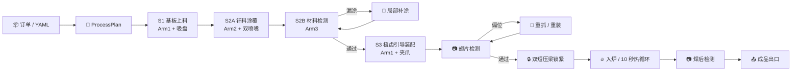
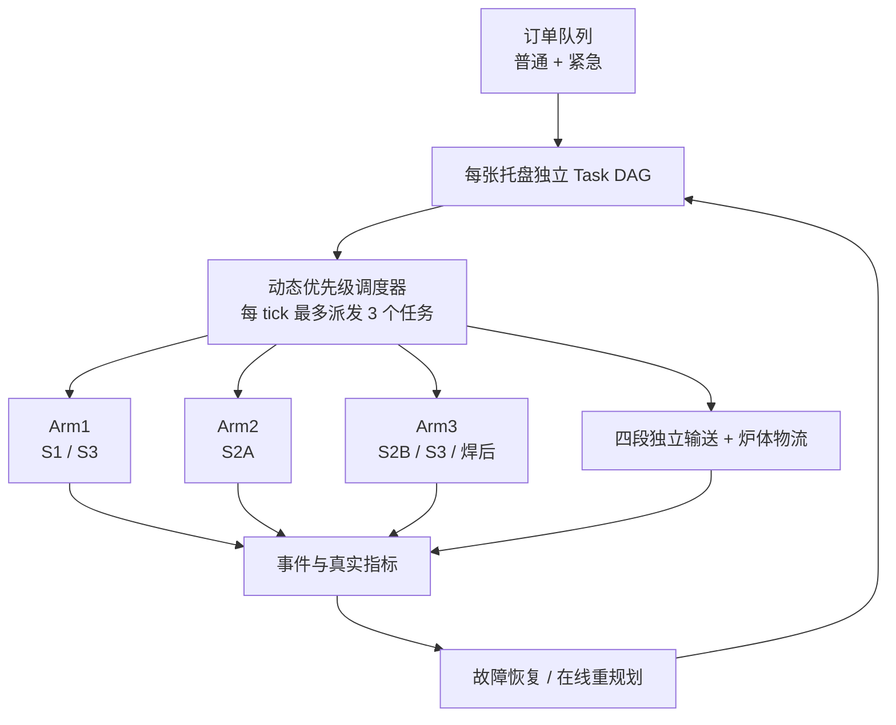

<div align="center">

# 🔥 FR3 多机械臂柔性钎焊产线仿真

**用三台 Franka Research 3，在 MuJoCo 中完成散热片从订单到交付的完整制造闭环**

<p>
  
  
  
  
  
</p>


<p>
  <a href="#-30-秒看懂这个项目">项目亮点</a> ·
  <a href="#-快速开始">快速开始</a> ·
  <a href="#-柔性订单">柔性订单</a> ·
  <a href="#-多订单协同">多订单协同</a> ·
  <a href="#-故障注入与自动恢复">故障恢复</a> ·
  <a href="#-软件架构">软件架构</a>
</p>

</div>

---

## 👀 30 秒看懂这个项目

这是一个面向低压配电柜散热组件的柔性制造仿真 MVP。用户提交 A、B、C 或 YAML
自定义订单后，系统会自动生成产品几何、钎料路径、工装选择、任务图和料架分配，
再由三台 FR3 协作完成：

| 机械臂 | 主要职责 | 仿真中的可见动作 |
|:---:|---|---|
| 🦾 **Arm1** | 基板上料、翅片抓取与安装 | 吸盘/夹爪换刀、渐进夹紧、逐片插入梳齿槽 |
| 🦾 **Arm2** | 钎料预涂与局部补涂 | 双喷嘴蛇形涂覆、逐条生成黄色钎料线 |
| 📷 **Arm3** | 材料、翅片和焊后检测 | 腕部相机对准、扫描、缺陷判定与复检 |

系统不只“播放动画”，还同时维护任务 DAG、资源占用、区域锁、工件真值、返工次数、
炉门互锁、托盘所有权和 KPI。故障会真实改变 MuJoCo 中的几何或设备状态，检测之后才会
触发对应恢复流程。

### ✨ 核心能力

- 📦 **订单参数驱动**：A/B/C 与严格 YAML 配置共用一套执行主线。
- 🧩 **物理工装换型**：15/20/30 mm 梳齿、短压梁和托盘随订单变化。
- 🔀 **多订单异步流水**：最多三张托盘在制，不同机械臂可在不同工位并行。
- 🧠 **任务图动态调度**：`ProcessPlan → Task DAG → Scheduler → Skills`。
- 🛠️ **可见故障与恢复**：漏涂、偏位、设备离线、输送超时、炉门互锁等。
- 🔥 **完整炉体闭环**：装炉、10 秒热循环、出炉检测、成品出口和空托盘返回。
- 🖥️ **规划控制台**：订单、任务图、工程示意、资源、故障、物流与实验指标。
- ⚡ **0.25×～32× 倍速**：只改变仿真推进速度，不改变任务依赖与质量结果。

## 🏭 一张图看懂生产流程



当前主线采用浅 U 形异步布局：

```text
S1 基板装载 (-0.48, 0.00)
    → S2A 钎料涂覆 (-0.30, 0.40)
    → S2B 材料检测 ( 0.30, 0.40)
    → S3 翅片装配/压紧 (0.48, 0.00)
    → 料架入口 (1.00, 0.00)
    → 炉体 → 焊后检测 → 成品出口
```

## 🎬 真实仿真画面

| Arm2 逐条涂覆 | Arm1 逐片安装 |
|:---:|:---:|
|  |  |
| 黄色钎料线跟随喷嘴的实际运动逐渐生成 | 翅片由夹爪送入前后梳齿槽并保持姿态 |

| 炉内热循环 | 成品出口交付 |
|:---:|:---:|
|  |  |
| 托盘、模具与产品作为整体进出炉体 | 出口门完全打开后整托盘进入，空托盘原路返回 |

> 截图来自项目实际 MuJoCo 流程，不是概念效果图。

## 🚀 快速开始

### 1. 环境要求

- Python 3.10+
- MuJoCo 3.1+
- NumPy、PyYAML
- PySide6（可选，用于 Qt 规划控制台）
- macOS 图形模式建议使用 `mjpython`

```bash
git clone https://github.com/w-mone-y/Flexible-process-for-heat-sinks-based-on-FR3.git
cd Flexible-process-for-heat-sinks-based-on-FR3

# 安装运行依赖
make install

# 安装 UI、测试和格式化依赖
make install-dev
```

### 2. 启动交互式产线

```bash
# 打开 MuJoCo Viewer 与 Qt 控制台，再从 UI 加入订单
mjpython brazing_line.py

# 直接运行指定订单
mjpython brazing_line.py --order A
mjpython brazing_line.py --order B
mjpython brazing_line.py --order C

# 三件 A 型三层批次
mjpython brazing_line.py --batch A
```

### 3. YAML 柔性订单

```bash
# 只加载、生成和校验计划，不启动 MuJoCo
python run_flexible_order.py \
  --order config/orders/order_001.yaml \
  --dry-run

# 图形模式
python run_flexible_order.py \
  --order config/orders/order_002.yaml

# 多订单动态调度
python run_flexible_order.py \
  --orders config/orders/batch_abc.yaml \
  --scheduler dynamic

# 无界面 32× 实验
python run_flexible_order.py \
  --orders config/orders/batch_abc.yaml \
  --scheduler dynamic \
  --headless --speed 32
```

<details>
<summary><strong>macOS 出现 mjpython / otool 状态码 69 怎么办？</strong></summary>

这通常表示当前机器尚未接受 Xcode License。只需执行一次：

```bash
sudo xcodebuild -license accept
otool -l "$(which python)" >/dev/null && echo "Xcode tools ready"
mjpython brazing_line.py
```

</details>

## 📦 柔性订单

| 产品 | 基板尺寸 | 翅片 | 节距 | 梳齿模块 | 钎料路径 | 压紧力 |
|:---:|---|---:|---:|---:|---:|---:|
| **A** | 0.36 × 0.22 × 0.008 m | 5 | 20 mm | 20 mm | 10 | 20 N |
| **B** | 0.36 × 0.24 × 0.008 m | 4 | 30 mm | 30 mm | 8 | 18 N |
| **C** | 0.34 × 0.20 × 0.008 m | 7 | 15 mm | 15 mm | 14 | 22 N |

配置职责：

```text
config/products/          产品几何、翅片、喷嘴与压紧参数
config/orders/            数量、优先级、交期与首选料架层
config/fixture_modules.yaml
config/process_recipes.yaml
config/rack_config.yaml
config/resources.yaml
config/scheduler.yaml
```

加载器采用严格校验。缺字段、未知字段、错误类型、负数、路径越界、超过 12 片翅片 /
24 条路径容量，或没有可用料架层，都会在机械臂运动前给出“文件 + 字段路径 + 原因”，
不会带着错误配置进入仿真。

## 🔀 多订单协同

物理场景预留三张在制托盘和一张备用托盘，WIP 上限为 3。超出的订单继续留在虚拟队列，
前一张托盘释放后再进入产线。



- 四段 slide actuator 分别驱动 `S1→S2A→S2B→S3→料架入口`。
- 托盘所有权按“源工位 → 输送段 → 目标工位”原子交接，禁止一托多属。
- 不同机械臂可在互不冲突的工位同时运行。
- S3 对 Arm1 和 Arm3 实行严格互斥，公共区域使用独立区域锁。
- 紧急订单不会打断正在进行的抓取、涂覆或输送，只竞争下一次资源释放。
- 动态调度冲突会保持 READY 并等待，不会因为暂时无路可走就直接进入 ERROR。

## 🛠️ 故障注入与自动恢复

Qt 的“故障与恢复规划”页可以直接选择中文故障、目标和严重程度。故障先发生在对应工序，
再由检测或监控发现，最后执行恢复；不会在“开始修复”时才突然生成缺陷。

| 故障 | MuJoCo 中的可见表现 | 默认恢复 |
|---|---|---|
| 钎料漏涂 | 黄色焊缝出现真实断口 | Arm3 检出 → Arm2 局部补涂 → 复检 |
| 钎料偏轨 | 实际焊缝偏移并显示红色标准线 | 重规划缺陷路径并补涂 |
| 翅片偏位 | 翅片发生真实平移或倾斜 | Arm1 重抓、重装并复检 |
| Arm 离线 | 对应机械臂停止并变红 | 停止派工，资源恢复后继续 |
| 输送超时 | 带面停在故障位置并变红 | 所有权确认、回零、重试一次 |
| 炉门互锁 | 炉门卡在半开位置 | 保持托盘锁定，恢复后重新检查互锁 |
| 炉温异常 | 热区与加热管颜色变化 | 输出返工或报废分级 |

每条返工路径具有次数上限，同一故障事件只插入一次恢复链。恢复不会重建 Viewer，
也不会清空无关订单和托盘。

## 🖥️ Qt 规划控制台

| 页签 | 可以做什么 |
|---|---|
| 📦 **订单规划** | 选择 A/B/C、数量、优先级、交期，预览并加入普通/紧急订单 |
| 🧠 **任务图 / 调度** | 查看实时 DAG、节点状态、依赖、资源和失败原因 |
| 📐 **产品工程图规划** | 查看俯视/正视/侧视尺寸示意，导出 PNG/SVG |
| 🚦 **资源与区域** | 查看机械臂、工具、炉体、输送和区域锁状态 |
| 🛠️ **故障与恢复规划** | 注入故障、查看恢复链、重试或转人工 |
| 🔥 **批次与物流** | 查看三层料架、炉门、托盘和成品出口 |
| 📊 **指标与实验** | 查看利用率、等待时间、吞吐、makespan 和调度对比 |

控制台还保留单独运行取放、检测 1、Arm2 涂覆、翅片安装、检测 2、直线入炉，
以及暂停、继续、复位、加速 ×2 和减速 ÷2。

## 🧠 软件架构

```text
订单队列
  ↓
ProcessPlan（产品几何 + 路径 + 工装 + 配方 + 层位）
  ↓
TaskGraph（每张托盘独立 DAG）
  ↓
FixedSequenceScheduler / DynamicPriorityScheduler
  ↓
SkillRegistry → Arm1 / Arm2 / Arm3 / 输送 / 炉体 actor
  ↓
事件总线 → 质量检测 → RecoveryPolicy → 在线重规划
  ↓
JSONL / CSV / KPI / Qt / HTTP API
```

```text
brazing_line.py               主入口、Viewer 与 headless 主循环
brazing_line.xml              三台 FR3 与柔性产线 MJCF
brazing_line_cinematic.py     精细视觉版入口
run_flexible_order.py         YAML、dry-run、多订单与实验入口
config/                       产品、订单、配方、资源和调度配置
brazing_sim/
├── domain.py                 强类型订单、产品、任务和检测状态
├── flexible/                 配置加载、几何生成、工装和计划
├── planning/                 ManufacturingTask 与 TaskGraph
├── scheduling/               固定/动态调度、资源和区域锁
├── execution/                技能注册、actor 适配和超时监测
├── recovery/                 故障模型、恢复策略和在线重规划
├── experiments/              事件指标与 fixed/dynamic 对比
├── motion.py                 FR3 控制、IK 与平滑轨迹
├── inspection.py             Arm3 检测姿态与相机几何
├── fixture.py                梳齿、压梁与力控压紧
├── async_line_router.py      四段输送与托盘所有权
├── batch_transfer.py         入炉、料架、出炉和成品交付
└── api.py / ui.py            HTTP、终端与 Qt 控制台
```

更完整的中文职责说明见：

- [📚 项目目录说明](docs/项目目录说明.md)
- [🎨 视觉模型与资产说明](docs/视觉模型与资产说明.md)
- [🕰️ 旧电气板装配流程](docs/legacy_electrical_board.md)

<details>
<summary><strong>展开查看关键物理与运动约束</strong></summary>

- 所有槽位、涂覆和检测姿态均由产品坐标生成，不为 A/B/C 分别硬编码世界坐标。
- 抓取、工具和托盘连接使用 MuJoCo `equality weld` 表达工艺约束。
- Arm1 抓取和放置阶段锁定第七关节；姿态调整必须在安全高度完成。
- 基板或翅片被抓住后保持世界姿态，最终 XY 对准后再垂直下降。
- 夹爪使用渐进闭合；释放后小幅张开并垂直撤离，避免碰撞相邻翅片。
- Arm2 使用永久安装的叉形双喷嘴，工具 Z 轴始终竖直向下。
- 奇数槽从 `-X` 到 `+X`，偶数槽反向，形成连续蛇形路径。
- 梳齿在材料检测通过后安装，短压梁在翅片检测通过后安装，避免喷嘴穿模。
- 压梁使用真实 slide joint、位置执行器、浮动关节和 touch sensor。
- 托盘、模板、梳齿、压梁、基板、翅片与钎料作为整体进出炉体。
- 出口门完全打开后产品才进入箱体；产品移交后空托盘沿原路径返回。
- `preflight_check()` 会在启动前检查 body/site/joint/actuator/sensor/weld 与可达性。

</details>

## 🎨 标准版与精细视觉版

| 版本 | 适用场景 | 特点 |
|---|---|---|
| **标准版** | 日常开发、调试、高倍速实验 | 更高 RTF，完整物理和任务逻辑 |
| **精细版** | 截图、录屏、项目展示 | 更细炉体/出口/喷管视觉层，4096 阴影与 4× MSAA |

```bash
# 标准版
mjpython brazing_line.py --order A

# 精细视觉版
mjpython brazing_line_cinematic.py --order A
mjpython brazing_line_cinematic.py --batch A
```

精细版只增加 `contype=0 / conaffinity=0` 的视觉几何，不改变碰撞、IK、状态机、
故障恢复和质量结果。

## 🌐 HTTP 与终端接口

<details>
<summary><strong>展开查看常用接口</strong></summary>

默认 HTTP 地址：`127.0.0.1:8766`

| 接口 | 作用 |
|---|---|
| `GET /state` | 订单、任务、机械臂、物流、炉体、质检和 KPI |
| `POST /order` | 启动 A/B/C 单订单 |
| `POST /orders/plan` | 校验并预览运行时订单 |
| `POST /orders/insert` | 加入普通或紧急订单 |
| `GET /tasks` / `/resources` / `/metrics` | 查询调度与实验状态 |
| `GET /fault-catalog` | 获取中文故障目录 |
| `POST /faults/inject` | 注入可见故障 |
| `POST /scheduler/replan` | 手动请求重新调度 |
| `POST /stop` / `/continue` / `/reset` | 暂停、继续和复位 |
| `POST /speed` | 当前速度加倍或减半 |

常用终端命令：

| 命令 | 作用 |
|---|---|
| `order_a` / `order_b` / `order_c` | 启动 A/B/C |
| `batch_a` | 启动三件 A 型批次 |
| `pick_place` / `arm2_motion` / `fin_assembly` | 单独播放关键工序 |
| `inspection_1` / `inspection_2` | 单独运行两类检测 |
| `rack_transfer` | 单独运行直线入炉 |
| `fault brazing_gap slot_02_left` | 注入局部漏涂 |
| `fault fin_pose fin_02` | 注入翅片偏位 |
| `status` / `stop` / `continue` / `reset` | 状态与流程控制 |

</details>

## ✅ 测试与质量门槛

```bash
make check
make test
make test-headless
make test-batch
make test-flexible
make test-v2
make test-cinematic
```

测试覆盖严格 YAML、A/B/C 几何、12/24 对象池、动态喷嘴、梳齿选型、Arm1 抓取安装、
多托盘所有权、资源互斥、炉门互锁、暂停/继续、故障恢复、Task DAG、动态调度、
headless 完整闭环和旧入口回归。

焊后质量结果：

```text
综合分数 = 0.35 × 覆盖 + 0.25 × 几何 + 0.25 × 温度 + 0.15 × 夹具
```

| 分数 / 条件 | 结果 |
|---|---|
| `score ≥ 0.90` | ✅ `PASS` |
| `0.75 ≤ score < 0.90` | 🛠️ `REWORK_REQUIRED` |
| `score < 0.75` 或严重越界 | ❌ `SCRAPPED` |

## 📌 项目边界

- 本项目模拟机械运动、工艺顺序、质量真值、物流与调度。
- 不模拟真实金属熔化、润湿、热传导、钎料化学反应或托盘结构强度。
- 当前炉温、喷嘴速度和压紧力均为演示参数，不应直接用于真实生产。
- 相机用于可视化，质量判定目前来自仿真真值。
- 工程图页是二维规划示意，不是经过认证的生产级 CAD/DXF 图纸。

---

<div align="center">

### 🌟 如果这个项目对你有帮助，欢迎 Star、Fork 或基于 `v1.0.0` 创建新分支继续开发

**Flexible manufacturing is not one fixed animation — it is one system that can understand and execute different orders.**

</div>
